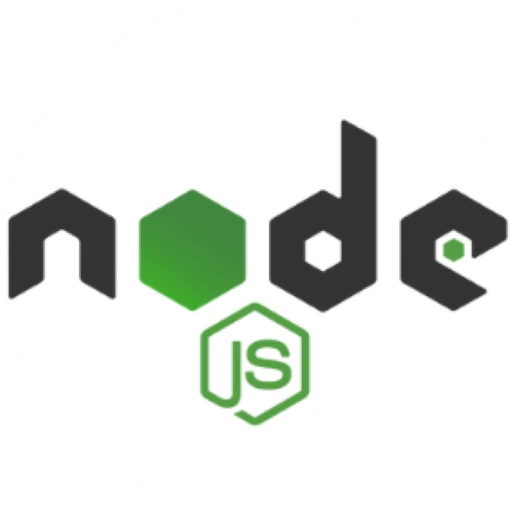
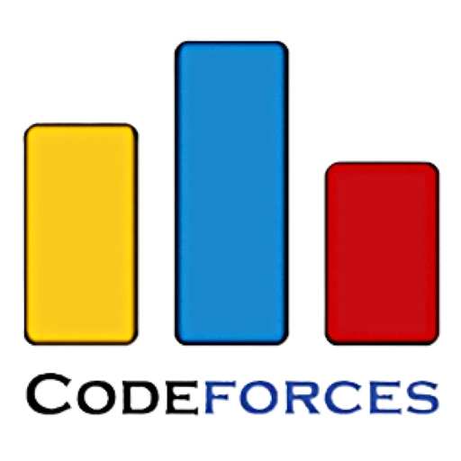
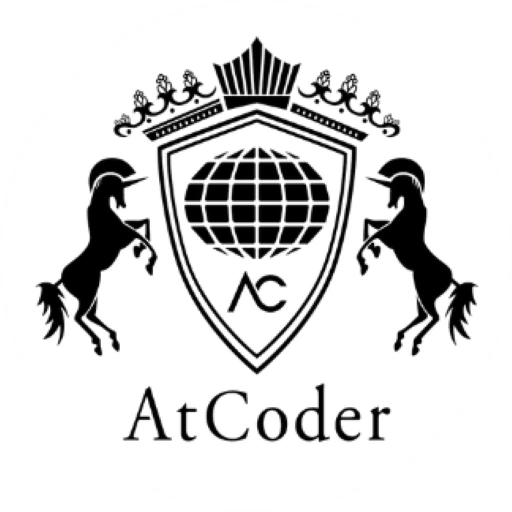
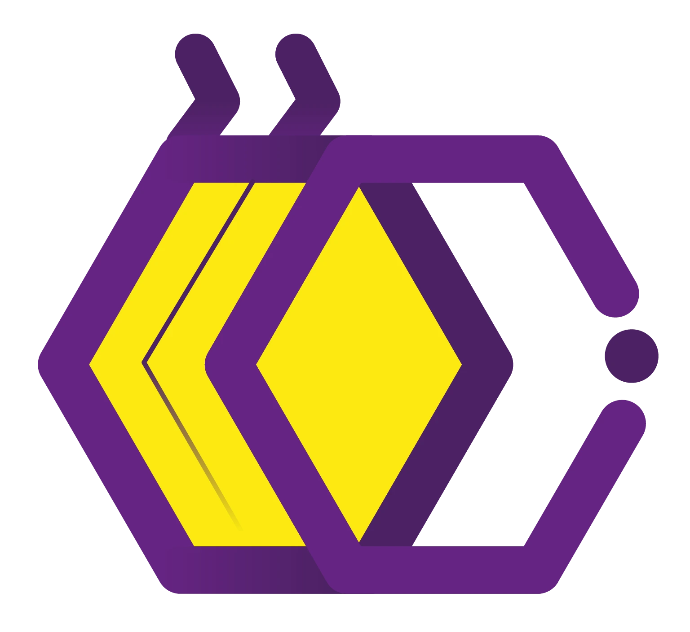

  

   

  
  <h1>Hi, I'm Ashraful Alam 👋</h1>
  
  <h3>🚀 Full-Stack Developer | 🏆 Competitive Programmer | 🎓 CSE Student at IIUC</h3>  

  

     &nbsp;&nbsp;&nbsp;&nbsp;&nbsp;&nbsp;
     &nbsp;&nbsp;&nbsp;&nbsp;&nbsp;&nbsp;
     &nbsp;&nbsp;&nbsp;&nbsp;&nbsp;&nbsp;
    
  

---

 

## 👨‍💻 About Me

🎓 Computer Science & Engineering student at **International Islamic University Chittagong (IIUC)**  
💻 Passionate about building scalable web applications with **MERN/PERN** stacks  
🏆 Active competitive programmer solving algorithmic challenges  
🚀 Always learning new technologies and contributing to open-source  
🌱 Currently exploring **Cloud Architecture** and **System Design**

---

## 🛠️ Tech Stack

### 💻 Programming Languages

   &nbsp;&nbsp;&nbsp;
   &nbsp;&nbsp;&nbsp;
   &nbsp;&nbsp;&nbsp;
   &nbsp;&nbsp;&nbsp;
  

### 🎨 Frontend Development

   &nbsp;&nbsp;&nbsp;
   &nbsp;&nbsp;&nbsp;
   &nbsp;&nbsp;&nbsp;
   &nbsp;&nbsp;&nbsp;
   &nbsp;&nbsp;&nbsp;
   &nbsp;&nbsp;&nbsp;
   &nbsp;&nbsp;&nbsp;
   &nbsp;&nbsp;&nbsp;

### ⚙️ Backend & Database

   &nbsp;&nbsp;&nbsp;
   &nbsp;&nbsp;&nbsp;
   &nbsp;&nbsp;&nbsp;
   &nbsp;&nbsp;&nbsp;
   &nbsp;&nbsp;&nbsp;
   &nbsp;&nbsp;&nbsp;
   &nbsp;&nbsp;&nbsp;
   &nbsp;&nbsp;&nbsp;
   &nbsp;&nbsp;&nbsp;
   &nbsp;&nbsp;&nbsp;
   &nbsp;&nbsp;&nbsp;
   &nbsp;&nbsp;&nbsp;

### ☁️ DevOps & Tools

   &nbsp;&nbsp;&nbsp;
   &nbsp;&nbsp;&nbsp;
   &nbsp;&nbsp;&nbsp;
   &nbsp;&nbsp;&nbsp;
   &nbsp;&nbsp;&nbsp;
   &nbsp;&nbsp;&nbsp;
   &nbsp;&nbsp;&nbsp;
  

 

---

## 🚀 Featured Projects

### 🎯 IIUC Lost & Found
**Jan 2026 – Present**

   &nbsp;&nbsp;&nbsp;
   &nbsp;&nbsp;&nbsp;
   &nbsp;&nbsp;&nbsp;
   &nbsp;&nbsp;&nbsp;
   &nbsp;&nbsp;&nbsp;
   &nbsp;&nbsp;&nbsp;

A secure university-wide platform for reporting and claiming lost items. It features **Role-Based Access**, **Google Auth (@ugrad.iiuc.ac.bd only)** restriction, and optimized database queries using Prisma.

  
  &nbsp;
  

### 🛍️ Ashraf's Fashion Hub
**Oct 2025 – Dec 2025**

   &nbsp;&nbsp;&nbsp;
   &nbsp;&nbsp;&nbsp;
   &nbsp;&nbsp;&nbsp;
   &nbsp;&nbsp;&nbsp;
   &nbsp;&nbsp;&nbsp;
   &nbsp;&nbsp;&nbsp;
  

A full-featured **E-commerce platform** built with the PERN stack. Users can browse products, manage carts, and place orders. Includes a comprehensive **Admin Dashboard** for managing inventory, orders, and users. Implemented secure payment integration and order tracking.

  
  &nbsp;
  

### 🩸 BloodSync
**Aug 2025 – Sep 2025**

   &nbsp;&nbsp;&nbsp;
   &nbsp;&nbsp;&nbsp;
   &nbsp;&nbsp;&nbsp;
   &nbsp;&nbsp;&nbsp;
  

A real-time blood donation platform designed for emergencies. Features include **Location-based donor discovery**, instant notifications, and secure authentication via **Appwrite**.

  
  &nbsp;
  

 

---

## 📈 Contribution Graph

## 🔥 Streak Statistics

---

## 🏆 Competitive Programming

   &nbsp;&nbsp;&nbsp;&nbsp;&nbsp;&nbsp;
   &nbsp;&nbsp;&nbsp;&nbsp;&nbsp;&nbsp;
   &nbsp;&nbsp;&nbsp;&nbsp;&nbsp;&nbsp;
   &nbsp;&nbsp;&nbsp;&nbsp;&nbsp;&nbsp;
   &nbsp;&nbsp;&nbsp;&nbsp;&nbsp;&nbsp;
  

---

## 🌐 Connect With Me

   &nbsp;&nbsp;&nbsp;&nbsp;&nbsp;&nbsp;
   &nbsp;&nbsp;&nbsp;&nbsp;&nbsp;&nbsp;
   &nbsp;&nbsp;&nbsp;&nbsp;&nbsp;&nbsp;
  

---

  <h1>🚀 Ready to Build Scalable Solutions?</h1>
  
  

    I am currently open to <b>Software Engineering Roles</b> where I can apply my  
    <b>Full-Stack Development</b> & <b>Algorithmic Problem Solving</b> skills to solve real-world challenges.
  

 

  

    
  

  
  

    "Building tomorrow's solutions with today's code"
  

